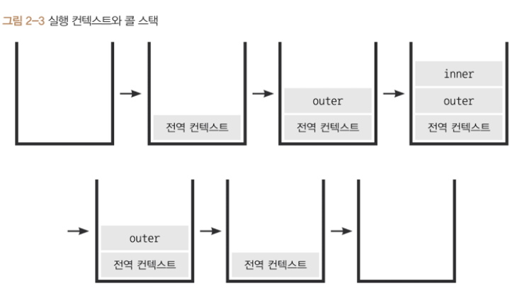

# 01) 실행 컨텍스트란?

실행할 코드에 제공할 환경 정보를 모아 놓은 객체이다.

실행 컨텍스트가 활성화 되는 시점에 선언된 변수를 호이스팅, 외부 환경 정보를 구성,this값을 설정하는 동작을 한다고 함

```jsx
//예시 코드
//전역

var a = 1

(function outer() {
		(function inner() {
			console.log(a)
			
			var a = 3
		})()
		
		console.log(a)
})()

console.log(a)

//결과
//undefined //호이스팅 때문에 Undifined
//1
//1
```



<aside>
💡

전체 코드 실행 → 콜 스택에 제일 먼저 실행된 전역 컨텍스트 push() → 다음 함수 outer push() → outer내에 있는 inner push() → inner.pop() → 호이스팅된 a 출력 undifined → inner.pop() →  전역변수 a출력 → 전역 컨텍스트 pop() → 전역변수 a 출력

</aside>

후기: 장난감 첢 자바스크립트 설명서 읽고 사용만 할 뿐 내부에서 콜스택 형식으로 작동하는 줄 몰랐음…