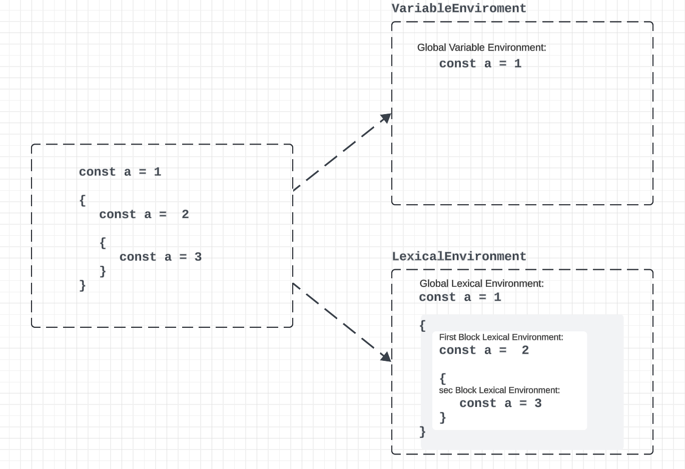

# 04 ~ 05

### 4) This

실행 컨텍스트에 thisBinding에는 this로 지정된 객체가 저장됩니다.
this가 지정되지 않은 경우 this에는 전역 객체가 저장됩니다.

```tsx
const obj = {
	name: 'Alice',
	sayHello: function() {
			console.log([this.name](http://this.name/))  // this는 obj를 가리킴
	}
}

obj.sayHello()
 // 출력: "Alice"
```

```tsx
function sayHello() {
  console.log(this)  // this는 전역 객체를 가리킴 (브라우저에서는 window)
}

sayHello()  // 출력: 전역 객체 (window)
```

### **5) 정리**

실행 컨텍스트는 실행할 코드에 제공할 환경 정보들을 모아놓은 객체입니다.

실행 컨텍스트는 실행할 코드에 제공할 환경 정보들을 모아놓은 객체입니다.

실행 컨텍스트 개체는 활성화되는 시점에 VariableEnvironment LexicalEnvironment, ThisBinding의 세 가지 정보를 수집합니다.

실행 컨텍스트를 생성할 때는  VariableEnvironment LexicalEnvironment가 동일한 내용으로 구성되지만 초기 구상태를 유지하는 VariableEnvironment와 달리 LexicalEnvironment는 함수 실행 도중에 변경되는 사항이 즉시 반영됩니다.

- **VariableEnvironment**는 초기 선언된 변수를 저장하며, 실행 도중 변경되지 않는 상태를 유지합니다. 이 환경은 전역 또는 함수가 실행될 때 초기 변수를 기록하지만, 이후 함수 실행 중 발생하는 변수의 변화는 반영하지 않습니다. 아래처럼 전역값만 저장합니다.
- 반면, **LexicalEnvironment**는 실행되는 함수나 블록 스코프에서 변수를 관리하며, 실행 도중 변수의 선언이나 값의 변경 사항이 즉시 반영됩니다. 각 블록이나 함수의 스코프에서 새로운 변수가 선언되면, 그 값은 **LexicalEnvironment**에 저장되며, 해당 스코프 내에서만 접근 가능합니다.


